# 🚀 MeterFlow – SaaS API Monetization Platform
🔗 Live Demo: https://your-link.vercel.app  
🔗 Backend API: https://your-backend.onrender.com
---

# 🧭 1. Introduction

MeterFlow is a **Software-as-a-Service (SaaS)** platform designed to help developers manage, monitor, and monetize APIs through a centralized gateway.

It provides a complete ecosystem where users can:

* Generate API keys 🔑
* Track API usage 📊
* Analyze request patterns 📈
* Purchase API credits 💳
* Access multiple APIs through a unified gateway 🌐

The platform simulates real-world API monetization systems similar to **RapidAPI** and **usage-based billing platforms**.

⚠️ **Note:**

* Payment integration is currently implemented using **Razorpay test mode (sandbox keys)**
* APIs used are primarily **free/open-source APIs** for demonstration purposes

---

## 📸 Product Preview

### 📊 Landing page
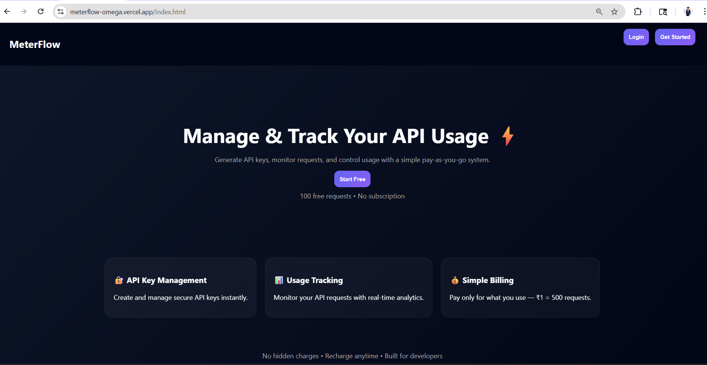

### 🔐 Authentication
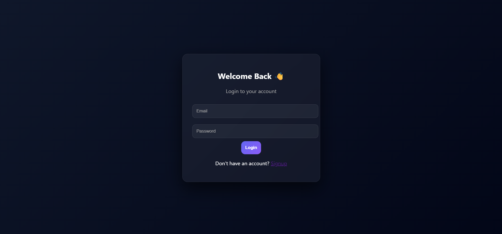

### 📊 Dashboard page
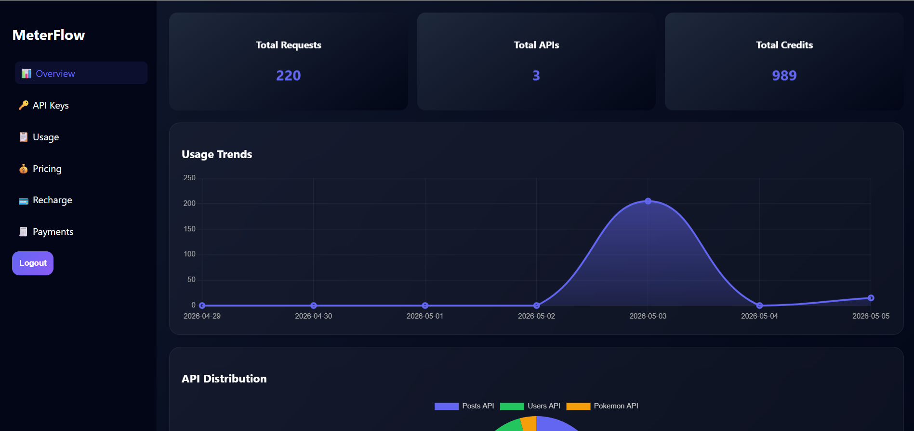

### 📈 Analytics
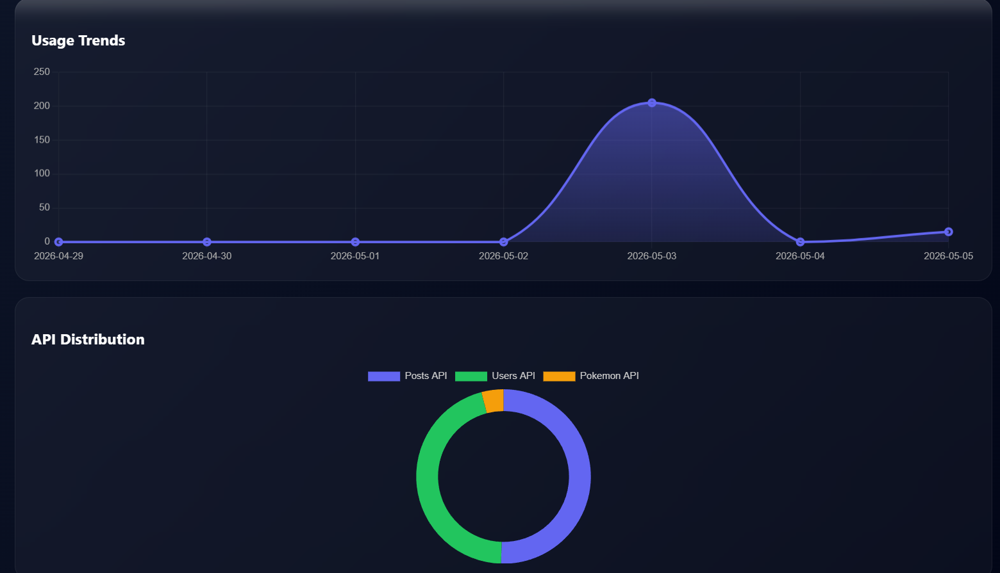

### 🔑 API Key Management
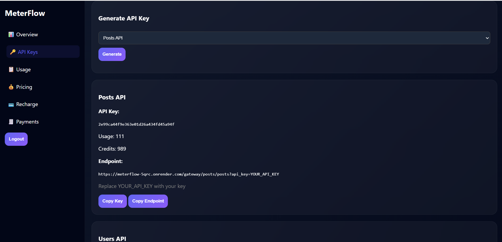

### 📜 Usage History
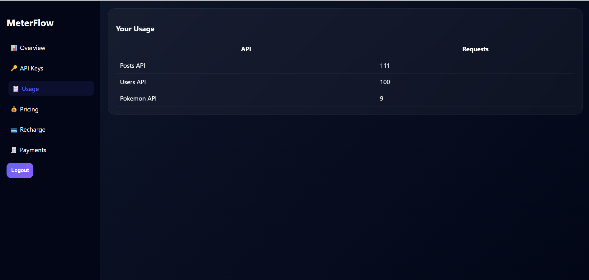

### 💰 Pricing
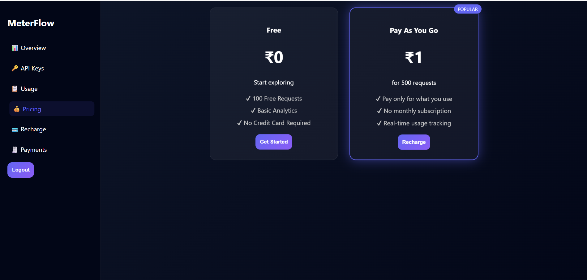

### 💸 Payment (Test mode)
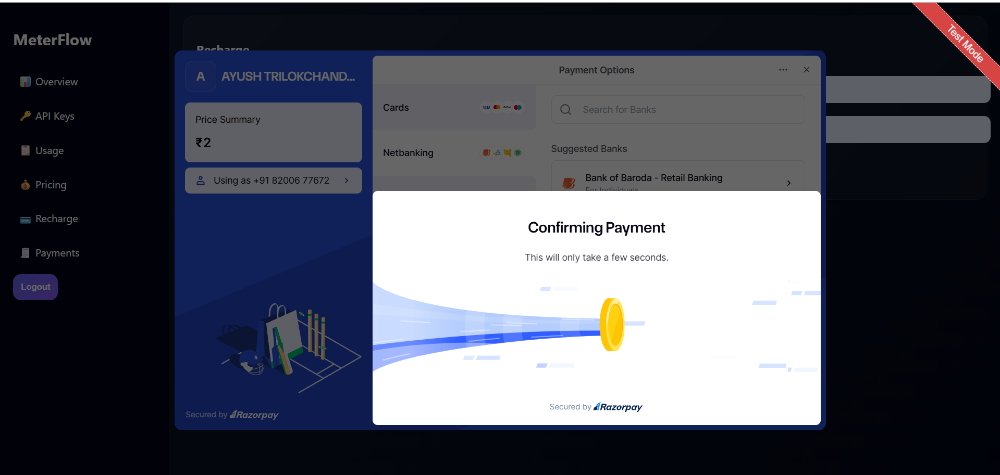

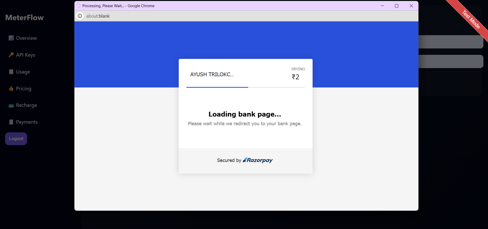

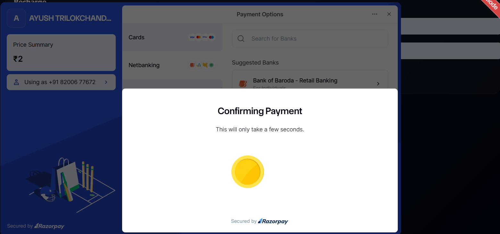

### 💳 Payment History
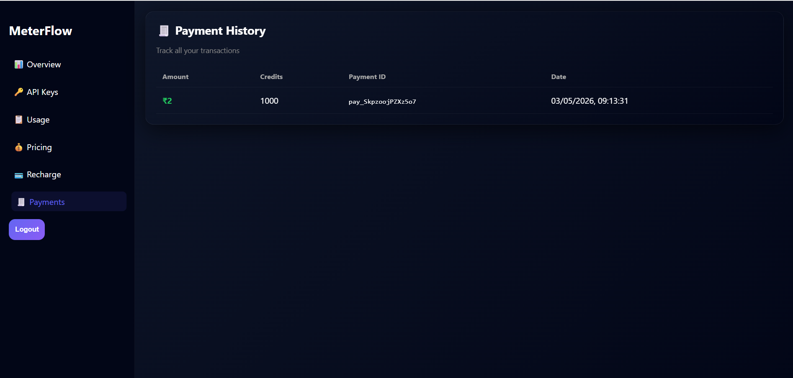


---

# 🗄️ 3. Database :

### Main Tables:

* `users`
* `apis`
* `api_keys`
* `usage_logs`
* `usage_summary`
* `wallet` (credits system)
* `payments`

---

# 🔄 4. Flow Chart (System Flow)

```text
User Request
    ↓
Frontend (Vercel)
    ↓
Backend API (FastAPI - Render)
    ↓
Authenticate (JWT)
    ↓
Validate API Key
    ↓
Check Free Limit
    ↓
Check Credits
    ↓
Forward Request to External API
    ↓
Store Usage Logs
    ↓
Return Response
```

---

# ⚙️ 5. Tech Stack

### 🖥️ Backend

* FastAPI (Python)
* PostgreSQL (Supabase)
* psycopg2 (with connection pooling)
* JWT Authentication

### 🌐 Frontend

* HTML, CSS, JavaScript
* Hosted on Vercel

### ☁️ Hosting

* Backend: Render
* Database: Supabase

### 💳 Payment Gateway

* Razorpay (Test Mode)

---

# 🚀 6. Working / Usage of the Website

### Step 1: Signup / Login

User creates an account and logs in.

---

### Step 2: Generate API Key

User selects an API and generates a unique key.

---

### Step 3: Use API via Gateway

```text
/gateway/{slug}/{endpoint}?api_key=YOUR_API_KEY
```

---

### Step 4: Free Usage

* First **100 requests are free**

---

### Step 5: Credit-Based Usage Model

* After free limit → each request consumes credits

* Users can purchase credits

* Example:
  👉 ₹1 = 500 API requests

* Credits are linked to API keys

* No real-time wallet deduction — instead **prepaid credits system**

---

### Step 6: Analytics & Monitoring

* Track usage per API
* View request trends
* Monitor remaining credits

---

# 💡 7. Advantages

* Centralized API gateway
* Credit-based monetization system
* Scalable backend architecture
* Real-time usage tracking
* Secure API key management
* Efficient database handling (connection pooling)

---

# 🏭 8. Industrial Use

MeterFlow can be used in:

* API SaaS platforms
* Developer marketplaces
* Pay-per-request API services
* Microservices monitoring systems
* Third-party API providers

---

# 📈 9. Industrial Value

* Enables **usage-based billing (credit model)**
* Simplifies API monetization
* Reduces backend complexity for developers
* Supports scalable SaaS architecture
* Useful for startups building API products

---

# 🧾 10. Conclusion

MeterFlow demonstrates a complete **SaaS-based API monetization system** with:

* Authentication system
* API gateway routing
* Credit-based billing
* Usage tracking & analytics
* Payment integration (test mode)

Although currently using sandbox payments and demo APIs, the platform is **architecturally ready for real-world deployment** with minor enhancements.

---

# ⭐ Show Support

If you like this project, give it a ⭐ on GitHub!
